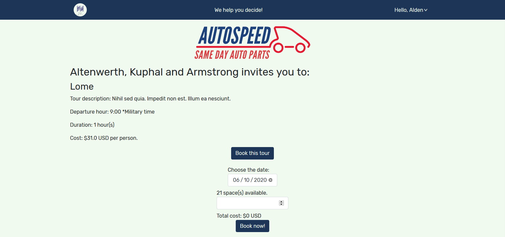

## Table of Contents
* [About the Project](#about-the-project)
* [Live version](#live-version)
* [Built With](#built-with)
* [Getting Started](#getting-started)
* [Tests](#tests)
* [API Documentation](#api-documentation)
* [License](#license)
* [Contact](#contact)
* [Acknowledgements](#acknowledgements)

<!-- about-the-project -->
# About the project

"hmmm" is an application where you can book tours to a city where you are traveling. You can filter the tours available by the municipality or by the company offering them. You will see more advanced information for the trip, and it will tell you how many journeys are left in real-time.

It is an MVP of an application and can be expanded to new functionality. Enjoy it!

PS: The onomatopeia of thinking inspires the name.

## Live version

> [Here](https://5edaa2d5b186b616885a172d--hmmm-app.netlify.app/)

## Built with

- Ruby 2.7.0
- Rails 6.0.3
- Node v13.11.0
- npm v6.13.7
- React v16.13.1
- Jest

## Getting started

To get a local copy up and running follow these simple steps.

Clone or fork the [repository](https://github.com/lucasmazo32/hmmm).

Currently, the page is not available for the local environment. If you want to reproduce it in your machine, allow the CORS for the localhost in the rails API.

## Tests

### REACT tests

Run `npm test` in the directory `/hmmm`.

### RAILS tests

Change to `/api_hmmm` directory. Run the following commands in that exact order:

- `rails db:create db:migrate RAILS_ENV=test`
- `rails db:reset RAILS_ENV=test`
- `bundle exec rspec`

## API Documentation

The documentation is in the directory `/hmmm`.

# License

> MIT

# Contact
Lucas Mazo:

- Twitter: [@lucasmazo32](https://twitter.com/lucasmazo32)
- Github: [lucasmazo32](https://github.com/lucasmazo32)
- LinkedIn: [Lucas Mazo](https://www.linkedin.com/in/lucasmazo/)

# Acknowledgements

- FontAwesome: [FontAwesome](https://fontawesome.com/)